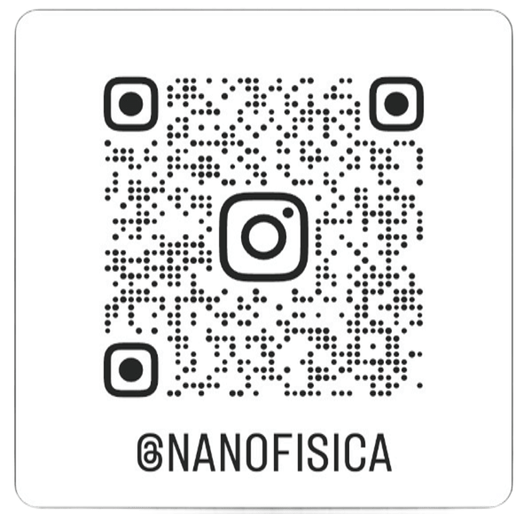

# ⚡ OMNI — Orchestrated Modeling of Nanomaterials under electric-field Influence

OMNI é uma ferramenta Python para **automação de cálculos DFT (SIESTA)** com aplicação de campos elétricos externos.  
Desenvolvido por **Henrique Lago** (Grupo de Nanofísica Computacional — GNC-UFPI) para automatizar workflows, gerar entradas `.fdf` com blocos de campo elétrico e coordenadas e vetores atualizados, estruturar diretórios por campo e gerenciar execuções do SIESTA com monitoramento em tempo real.

## Recursos principais
- Interface gráfica (Tkinter) para configurar FDF, arquivos PSF e `siesta.py`.
- Geração automática de séries de vetores de campo em X, Y e Z.
- Criação de diretórios por configuração de campo e cópia de arquivos necessários.
- Capacidade de retomar execução interrompida (salva estado em `calculation_state.json`).
- Extração automática de vetores/células a partir de arquivos `.out` para criar novos `.fdf`.
- Notificações e logs em tempo real na GUI.
- 
---

## Requisitos
- Python 3.10+ recomendado
- Bibliotecas Python:
  - `numpy`
  - `Pillow`
  - `sv_ttk`
  - (opcional, para temas modernos)
- SIESTA disponível no sistema e o script `siesta.py` contido na pasta do OMNI.

Instale as dependências (exemplo):

```bash

python3 -m venv .venv
source .venv/bin/activate
```

Você pode instalar as bibliotecas Python necessárias usando pip:

```bash 
pip install -r requirements.txt
```
---

## ⚙️ Instalação

Clone o repositório e instale as dependências:

```bash
git clone https://github.com/seu-usuario/OMNI.git
cd OMNI
```
# 📘 Guia de Uso Rápido

O programa foi projetado para ser usado em **três etapas simples**:

---

## 🔹 Passo 1: Configuração Inicial

- **Arquivo FDF**: Selecione o arquivo de entrada principal do **SIESTA** (`.fdf`).
- **Caminho para siesta.py**: Indica o caminho para o script auxiliar (`siesta.py`), por sua vez na pasta do software OMNI.py ja é selecionado automaticamente.
- **Arquivos PSF**: Adicione todos os arquivos de pseudopotencial (`.psf`) necessários para o sistema.
- **Nome da Pasta Base**: Defina o diretório de saída para todos os resultados dos cálculos.

---

## 🔹 Passo 2: Definição dos Campos

- Informe os **valores de início, fim e passo** para os campos nos eixos **X, Y e Z** .
- Selecione os **eixos** que serão utilizados para a simulação **ativos**.
- Clique em **"Gerar Campos"** para criar a tabela de campos a serem calculados.

---

## 🔹 Passo 3: Execução dos Cálculos

- Clique em **"Preparar Arquivos"** para criar as pastas de saída, cada uma com o arquivo `.fdf` atualizado para o respectivo campo elétrico.
- Clique em **"Executar Cálculos"** para iniciar a execução do **SIESTA**. O progresso será exibido na área de log.
- Utilize o botão **"Parar Execução"** para interromper o processo de forma segura.
- (Opcional) Use **"Tornar Inicial"** para salvar o estado atual e retomar o cálculo na próxima inicialização do programa.
---
## 🧪 Pasta de Testes

A pasta `test/` contém exemplos para **validar a instalação** e testar funcionalidades do OMNI.

### Executando os testes via terminal:

```bash
# Navegar para a pasta do software 
```

```bash

python3 OMNI.py

```
## 🛠️ Desenvolvimento

O **OMNI** foi desenvolvido em **Python 3.x** com foco em **automação de cálculos DFT-SIESTA sob campos elétricos externos**.  
O software combina interface gráfica moderna e rotinas de automação científica, utilizando as seguintes bibliotecas:

- **tkinter** → Interface gráfica (GUI)  
- **sv_ttk** → Temas modernos para tkinter  
- **Pillow (PIL)** → Manipulação e exibição de imagens (logos, QR code)  
- **NumPy** → Geração numérica de campos elétricos  
- **os, re, shutil, subprocess, threading, json** → Automação de arquivos, logs, execução e controle de estado  

---

## 📜 Licença

Este projeto está licenciado sob os termos da [Apache License 2.0](LICENSE).

---
## 🤝 Contribuições

Contribuições são bem-vindas!  
Você pode abrir uma **issue** para relatar bugs ou sugerir melhorias, ou enviar um **pull request** com novas funcionalidades.  

---

## 👨‍🔬 Sobre

Este software é um **projeto pessoal com foco acadêmico** desenvolvido no contexto de pesquisa em **Nanofísica Computacional**.  

**Autor:** Henrique Lago Liberato  
🎓 Aluno de Física – ICV/UFPI  
🔬 Membro do **Grupo de Nanofísica Computacional (GNC-UFPI)**  
👨‍🏫 **Orientador:** Prof. Dr. Ramon Sampaio Ferreira  

📧 **Contato:** [henrique.liberato@ufpi.edu.br](mailto:henrique.liberato@ufpi.edu.br)  

---

## 🔗 Conheça o GNC

Escaneie o QR Code abaixo para acessar:  

<p align="center">
  
</p>

